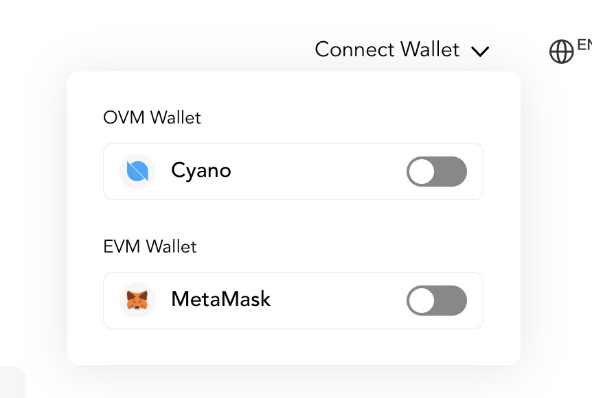
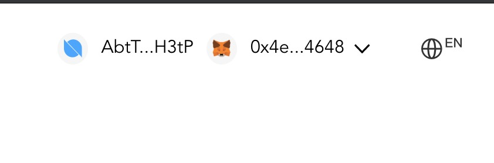
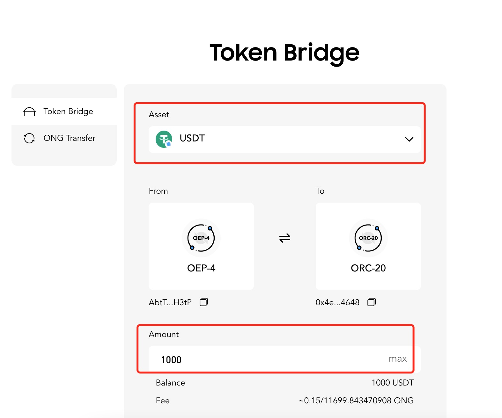
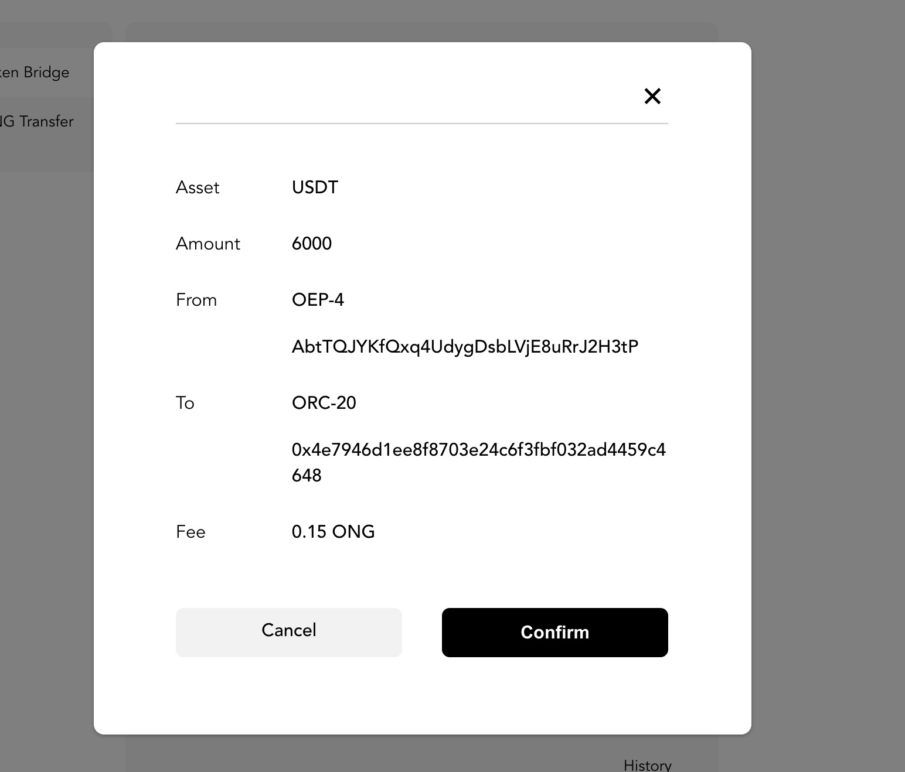
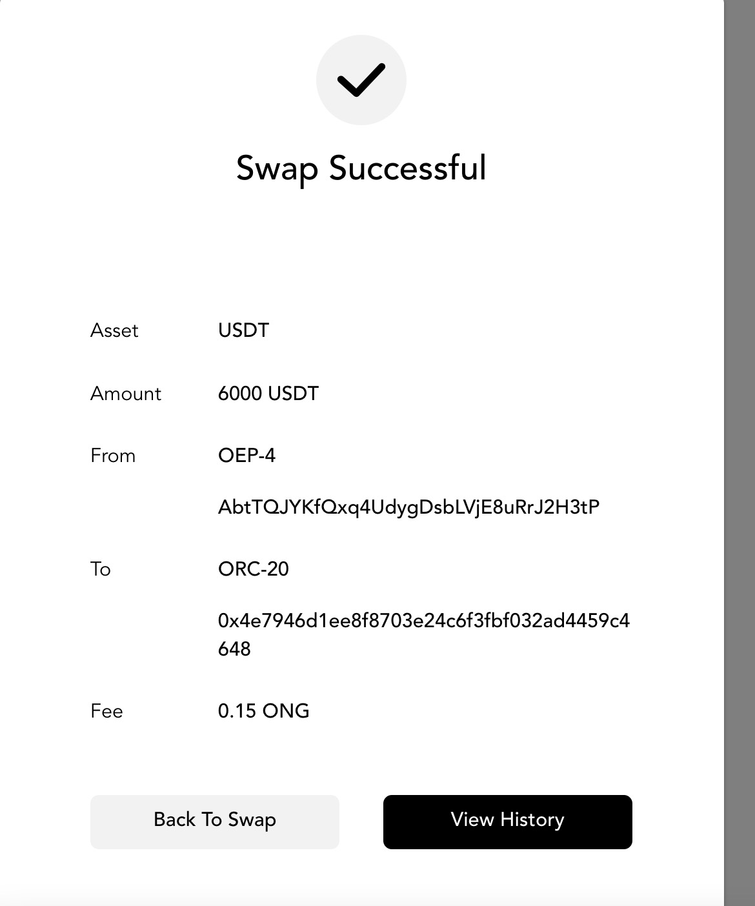
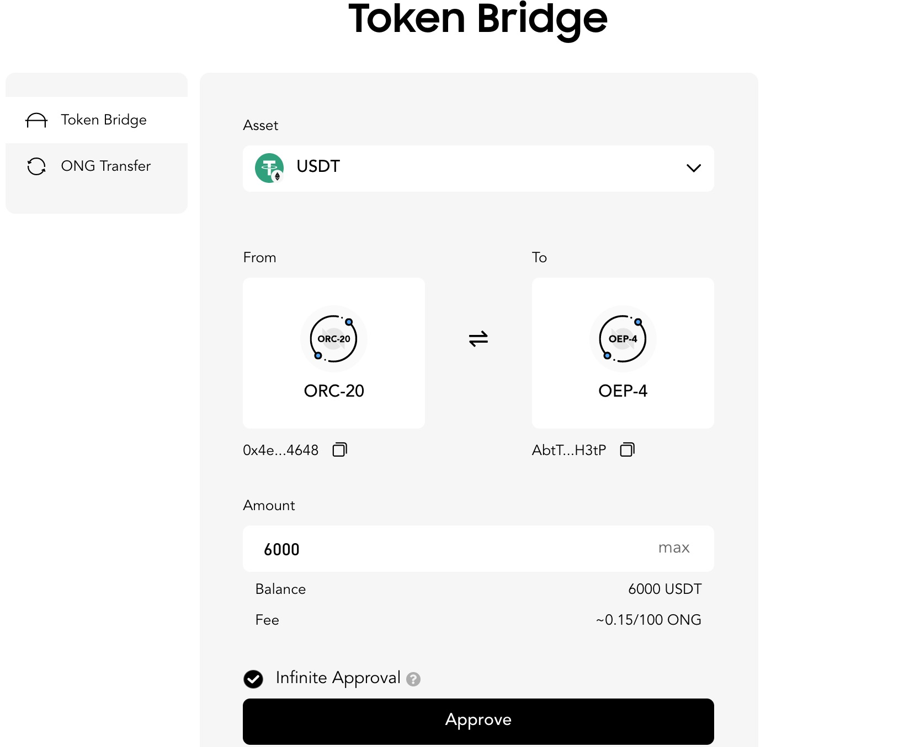

# Ont Bridge(本体桥)

本体网络已通过 Ontology EVM 虚拟机实现了对以太坊生态的兼容。目前本体支持的合约类型有NeoVm合约、Wasm合约和EVM合约。 由于ethereum和ontology的签名不能互相兼容，所以ERC20资产(EVM合约实现)
一定要保存在ethereum私钥对应的地址，OEP4资产(Neovm合约实现)一定要保存在ontology私钥对应的地址。 为了方便本体网络内部的ERC20资产和OEP4资产在不同账户之间互相流通，所以提供了该bridge服务，
该服务是通过在本体网络部署一本bridge合约（Wasm合约实现） 实现ERC20和OEP4 token在ethereum账户和ontology账户之间互相流转。

## bridge合约实现逻辑

* oep4 换 erc20 用户通过ontology的私钥签名调用bridge合约的`oep4ToErc20`方法, 该方法将用户的oep4 token转给bridge合约地址，
  然后把bridge合约地址里的对应数量的erc20资产转移给用户的ethereum私钥生成的地址。
* erc20 换 oep4

1. 用户需要先用ethereum私钥调用erc20 token的approve方法授权用户ontology私钥对应的地址可以把erc20 token转移走的能力。
2. 用户用被授权的ontology私钥调用bridge合约的 `erc20ToOep4`方法，该方法会将用户ethereum地址里面的token转移给bridge合约地址， 然后把相应数量的OEP4
   token转移给用户的ontology地址。

注意，不管是在oep4换erc20还是erc20换oep4的过程中，用户始终用的是ontology私钥和bridge合约交互，为了把用户ethereum地址里的 token转移走，需要用户使用ethereum
私钥进行授权操作。在兑换的过程中，切记 erc20资产始终存在ethereum私钥对应的地址， oep4 token始终存在ontology私钥对应的地址。

## 本体桥的使用

[本体桥的测试网址](https://bridge.ont.io/testnet/)

1. 打开连接，在有右上角，可以看到Connect Wallet，把鼠标放到改字体上，会显示如下图所示

分别点击 `Cyano`和 `MetaMask`连接wallet, 连接后如下图

2. 选择要兑换的资产，选择是oep4换成erc20还是erc20换成oep4

如果是oep4换erc20如下图所示

点击swap按钮会弹出如下的确认框

点击确认即可完成oep4到erc20的兑换,兑换成功会弹出如下的对话框

如果是erc20换oep4怎会显示如下图所示

需要先进行approve操作， approve成功后就和前面介绍的swap一样了。

